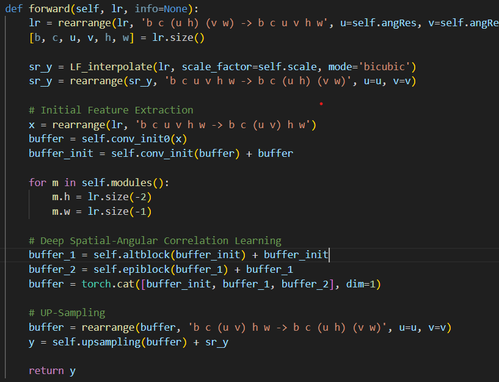
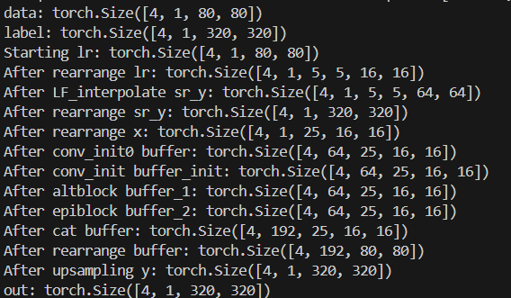

### 最基本的NET
{:height="100px" width="400px"}{:height="100px" width="400px"}
- 其中data和label是train.py中导入时的结果
- **由data生成lr**应该是拆解还原的过程
- conv_init与conv_init0 意义不明，问ai说是提取初始特征
- 得到的x处理三次再最后合并卷积上采样
### 模型使用关系
- NET
  - SpaAngFilter
    - SpaSSM
      - ResidualGroup
    - AngSSM
      - ResidualGroup
  - EPISSM
    - ResidualGroup
  - PixelShuffle
上述ResidualGroup的多次使用中只有 input_resolution 与 对x的rearragenge 不同
SpaSSM：在空间维度上进行处理，重排列方式为 **(b * a, c, h, w)**。
AngSSM：在角度维度上进行处理，重排列方式为 **(b * h * w, c, u, v)**。
EPISSM：结合了空间和角度维度的处理，重排列方式为 **(b * v * w, c, u, h)** 和 **(b * u * h, c, v, w)**，并且通过 ResidualGroup 层两次。
但是我还没有看出 input_resolution设置为16和5的原因qwq
 
- ResidualGroup
  - BasicLayer
    - depth * VSSBlock
      - ESS2D
      - CAB